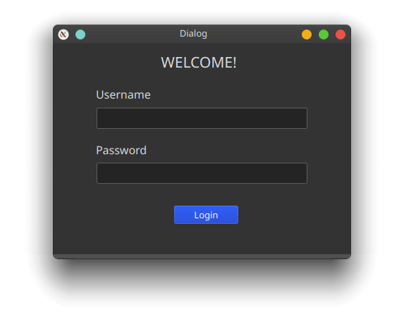

# TeamMe

## Overview

TeamMe is a model software system that faniliates active teaming of people with similar interest and skill-set to forge groups for a certain do-good project. For more details, please see the Software Requirements Specification and the Design Report below.

[***Software Requirements Specification***](https://github.com/tislam35/TeamMe/blob/master/Group%20S%20Software%20Requirements%20Specification.pdf)

[***Design Report***](https://github.com/tislam35/TeamMe/blob/master/Group%20S%20Design%20Report.pdf)

[***Memo***](https://github.com/tislam35/TeamMe/blob/master/Memo.pdf)

## Software Engineers

Tohidul Islam  
Sophie Huang  
Ekramul Sawrid  
Dor Ulman  

## Language 

Python

## Development Phase

GUI Implementation

# Major Files

1. system.py : contains all our functions for the bullet points. Functions are labeled throughly.
2. user.py : class for OU, VIP, US
3. register_visitor.py : class for visitors how are registered but not OU/VIP/SU
4. group.py : group class

## Installation and Implementation

### Installation
1. In your console or terminal, go to the directory you want to store this repository.
2. Type `git clone https://github.com/tislam35/TeamMe.git` to clone this repository to that directory.
3. Make sure to have PyQt5 library installed.
4. If not, run `pip install PyQt5` in console to install the library.

### Implementation

1. In your console or terminal, go the TeamMe project directory.
2. Type `cd gui_py_files`. 
3. Type `python browsing_home_page.py` to start TeamMe application.

Note: we have created 3 different users for you to login and test the application. They are:
1. SU --> Username: FSU, password: pass123
2. VIP --> Username: PeteVu1, password: PeteVu
3. OU --> Username: KimZhang1, password: KimZhang

Other OUs:

Username: HenryCruz1
Password HenryCruz

Username: LisaHamilton1
Password: LisaHamilton

## Some TeamMe GUIs

### Browsing the Application as Visitor

### Register

### Login

## TeamMe Application Walkthrough

1. After you start the application. The TeamMe Home Browser will pop up.

## Version

V0.51

