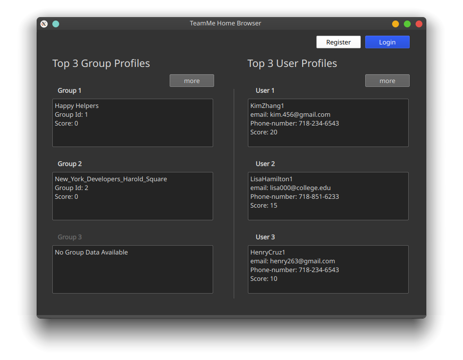
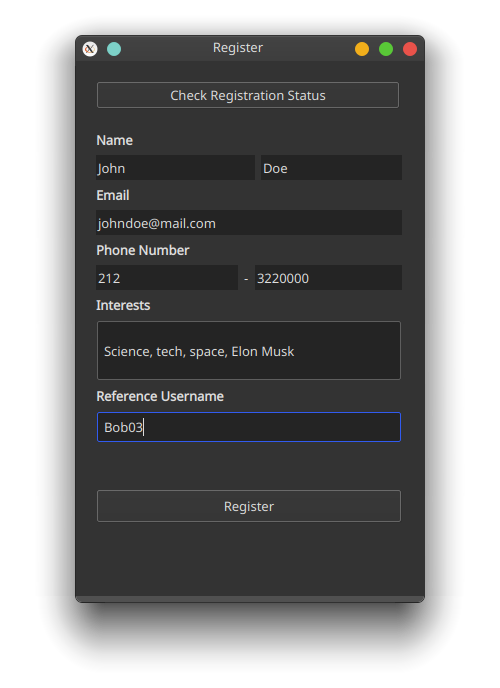

# TeamMe

## Overview

TeamMe is a model software system that faniliates active teaming of people with similar interest and skill-set to forge groups for a certain do-good project. For more details, please see the Software Requirements Specification and the Design Report below.

[***Software Requirements Specification***](https://github.com/tislam35/TeamMe/blob/master/Group%20S%20Software%20Requirements%20Specification.pdf)

[***Design Report***](https://github.com/tislam35/TeamMe/blob/master/Group%20S%20Design%20Report.pdf)

## Software Engineers

Tohidul Islam
Sophie Huang
Ekramul Sawrid
Dor Ulman

## Language 

Python

## Development Phase

Implementation

## Installation and Implementation

### Installation
1. In your console or terminal, go the directory you want to store this repository.
2. Type `https://github.com/tislam35/TeamMe.git` to clone this repository to that directory.
3. Make sure to have PyQt5 library installed.
4. If not, run `pip install PyQt5` to install the library.

### Implementation

1. In your console or terminal, go the TeamMe project directory.
2. Type `cd gui`. 
3. Type `python browsing_home_page.py` to start TeamMe application.

## TeamMe Application Walkthrough

### Browsing the Application as Visitor

### Register

### Login

### Create a group

## Version

V0.01

