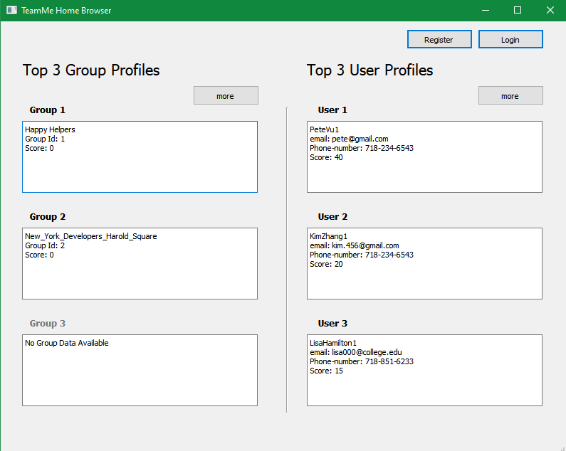

# TeamMe

<strong>For applcation walkthrough, go to [TeamMe Application Walkthrough](#teammewalkthrough) section of this readme.</strong>

## Overview

TeamMe is a model software system that faniliates active teaming of people with similar interest and skill-set to forge groups for a certain do-good project. For more details, please see the Software Requirements Specification and the Design Report below.

[***Software Requirements Specification***](https://github.com/tislam35/TeamMe/blob/master/Group%20S%20Software%20Requirements%20Specification.pdf)

[***Design Report***](https://github.com/tislam35/TeamMe/blob/master/Group%20S%20Design%20Report.pdf)

[***Memo***](https://github.com/tislam35/TeamMe/blob/master/Memo.pdf)

## Software Engineers

Tohidul Islam  
Sophie Huang  
Ekramul Sawrid  
Dor Ulman  

## Language and Technologies

Python 
PyQt5

## Development Phase

GUI Implementation for Incomplete Features 
Beta Version Testing for Completed Features

# Major Files

1. system.py : contains all our functions for the bullet points. Functions are labeled throughly.
2. user.py : class for OU, VIP, US
3. register_visitor.py : class for visitors how are registered but not OU/VIP/SU
4. group.py : group class

## Installation and Implementation

### Installation
1. In your console or terminal, go to the directory you want to store this repository.
2. Type `git clone https://github.com/tislam35/TeamMe.git` to clone this repository to that directory.
3. Make sure to have PyQt5 library installed and can run Python.
4. If not, run `pip install PyQt5` in console to install the library.

### Implementation

1. In your console or terminal, go the TeamMe project directory.
2. Type `cd gui_py_files`. 
3. Type `python browsing_home_page.py` to launch TeamMe application.

Note: we have created 3 different users for you to login and test the application. They are:
1. SU --> Username: FSU, password: pass123
2. VIP --> Username: PeteVu1, password: PeteVu
3. OU --> Username: KimZhang1, password: KimZhang

Other OUs:

Username: HenryCruz1
Password HenryCruz

Username: LisaHamilton1
Password: LisaHamilton

Note that you can reference, register, and approve new users as you like.

## Some TeamMe GUIs

### Browsing the Application as Visitor

### Register

### Login

## TeamMe Application Walkthrough

1. After you start the application. The TeamMe Home Browser will pop up. You can see the top 3 profiles and users. Note, we only have 3 groups in our system, so it only shows the top 2 groups.

2. If we want to create a new user that is not in the system, we need a reference first. Let us login as FSU. Click "Login" on top right cornor. A login window will pop up. Enter username: FSU, password: pass123. Press "Login"

3. You came to windown you were last before. If not in Home tab, go to home tab in top left cornor. This is your profile.

4. There is Browser tab next to Home tab. Click it. It is same as the TeamMe Home Browser. 

4. To view the each group page, click "Group 1", "Group 2", "Group 3" for the group page or "User 1", "User 2", "User 3" for user profile. Note, that once a visitor is approved to be OU or a group is fromed, a new page of the user or group can be seen.

5. The indox tab, has features related to groups activities but was not implemented on GUI.

6. In the Group Management Tab, ther is more features related to group activities but only the  "Write Complaint" and "Write Compliement" were implement. More on that later.

7. In the Admin (SU)* tab, we have SU* feature (only the Account Approval, Compliments, Complaints, we implemented)

8. To reference a user, go to the Indox tab and click "Refer" in top right cornor. A Reference Info window should pop up. Enter a email that is not in the system already and a score to assign. Note, a Referral Failed window will pop up if input is invalid.

9. Now log out. The log out button is in the top right of in the Home tab. You should be back to the TeamMe Home Broswer window. Click "Register" on the top right. A Register window should pop up. Enter your information. Note, the email must match what the reference's email and the Reference Username must match the user of the person who referred the visitor.

10. Now we must approve the registered visitor. We log in as FSU (username: FSU, password: pass123. After you login as FSU. Go to the Admin (SU)* tab and you will see that information about the registered user in the Account Approval box. We can Accept or Reject. Let us press "Accept" After we press "Accept" there is no other registered visitor to approve or reject. 

11. Now let us login as the new approved OU. Log out as FSU and log in as new user. The username and password are in the format shown.

12. Now your are in your account. As you can see, your score is 12, just as the reference score. Let us make a complaint about the user "PeteVu1". Go to Group Management tab and click "Write Complaint". Enter valid username (PeteVu1) and your reason. If you enter a invalid user, a window pops up saying username is invalid.  Click "Send Compliant" The compliement work the same way. You can compliement other users.

13. Now let us log back in as FSU (username: FSU, password: pass123) and check out some complaints and compliments. There is already quite a few compliements and complaints. If we accept, the score change is by 5 if complimented or -5 if complainted. Let us keep accepting all compliments and complaints. Our last complait will be for PeteVu1.

14. Let us check out the now leader board. Log in and log back out as FSU. The new leader board in the same due to same number of compliments and complients for the each of the users but if your write new compliements or complaints you will see changes.

15. Now let us login in as PeteVu1 and send a complaint with taboo words.

16. Let us login back in as FSU and see the complaint. Notice, PeteVu1 score ( 40 - 1 - 5 -1 = 29 ). We see that the message was converted. 

17. If we play around with the system. The score changes will we done and users can be promoted to OU, VIP, or kickedout or blacklisted. With promotions and demotes, the authorization will change (acess to tabs).   

## Version

V0.51

